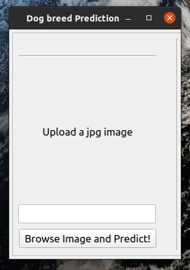
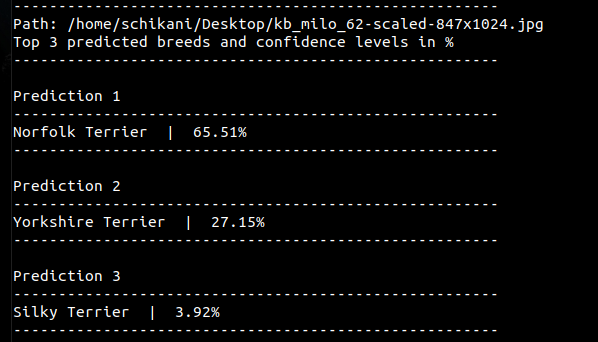

# dog-breed-prediction

### dog-breed-prediction is a Deep learning project which uses neural networks to determine the breed of a dog in a given image.

## Installation
* `$ mkdir dog-breed-prediction-base`
* `$ cd dog-breed-prediction-base`
* `$ virtualenv ./venv`
* `$ source ./venv/bin/activate`
* `$ git clone https://github.com/surendra660/dog_breed_prediction.git`
* `$ cd dog-breed-prediction`
* `$ pip install -r requirements.txt`

### Currently this project is tested in Ubuntu 20.04 but hopefully it should work in Mac and Windows sytems too.

### 1. GUI app
#### This is the GUI version of dog-breed-prediction 
**Note:** If you have problems opening this GUI version, try 2. Terminal app shown in the next section
* #### Run `$ python dog_breed_prediction_gui.py`
#### If everything works fine, you should see a similar result like shown below. Press "Browse Image and Predict!" button and select an image with (.jpg) format.

#### Just press "Browse Image and Predict!" button again to select another image and predict it's results. 

### 2. Terminal app

#### This is the terminal version of dog-breed-prediction  
* #### Run `$ python dog_breed_prediction_term.py custom-image.jpg`, Here instead of `custom-image.jpg`, type the path of an image you want to predict. 
#### If everything works fine, you should see a similar result like shown below.

